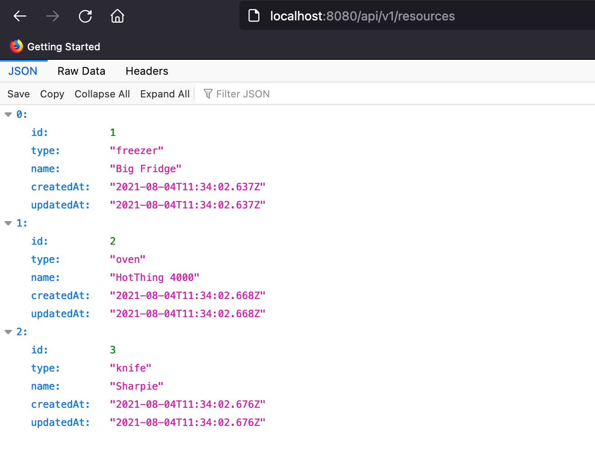

# Platform Operations Challenge

## Objective

Use Terraform to deploy the application in this repository to Google Cloud.
You can use Cloud Run, Managed Instance Groups or whatever you think is
most appropriate.

Here's what the application looks like when it's running locally:



Before you run it you'll need to tell it where to look for its database e.g.

```
export DB_CONNECT_STRING=sqlite:memory
```

We want to see logs and monitoring of the resources once they are deployed.

## What were looking for

* How you communicate when working
* How you document your work
* Use of version control
* What do you do to make this service operationally ready

## Extra Credit

* Replace the in memory database with a [Google Cloud Database](https://cloud.google.com/products/databases)
* A nice domain name
* Alerts for if the service goes down
* Load Testing

## What next?

Once you have read this README email us at {{ADDRESS}} and we will set you up with
a GCP project to work in and add you to a Slack channel where we can chat about the work.